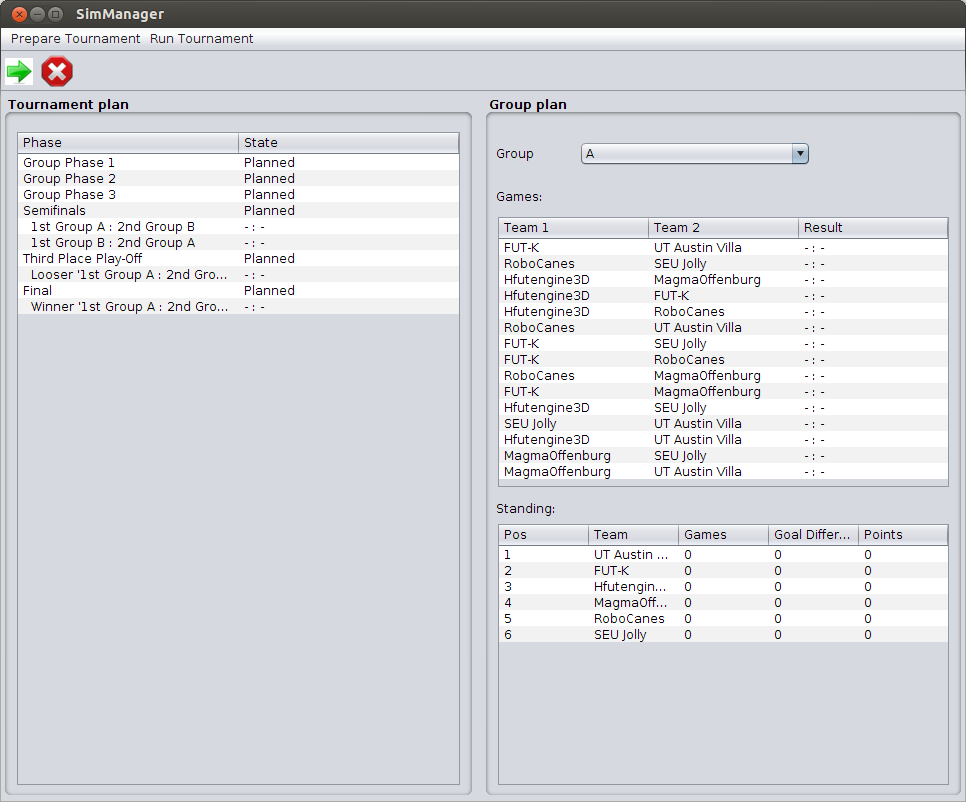

# magmaCompetition
Alpha version of a tool to run competitions in the [RoboCup 3D Soccer Simulation League](http://wiki.robocup.org/wiki/Soccer_Simulation_League) created by the [magmaOffenburg team](http://robocup.hs-offenburg.de/).

## Installation for development
- Clone the repository: `git clone https://github.com/magmaOffenburg/magmaCompetition`.
- In Eclipse, you might have to import the Maven project (PackageExplorer->RightClick->Import...->Maven->Existing Maven Project, choose folder magmaCompetition)
- Set up `clang-format` as described [here](https://github.com/hsoautonomy/formatting). 
- Make sure you have Java 8 or higher installed and available on your command line.
- Make sure you have [simspark and rcsserver3d](http://simspark.sourceforge.net/wiki/index.php/Main_Page) installed and the command `rcssserver3d` is available on the server's command line.
- Run class `magma.tools.competition.SimManager`

## Current State
As of now the tool is not ready to use. We are still developing important features to run games on a cluster.
A User guide is available in folder doc.

